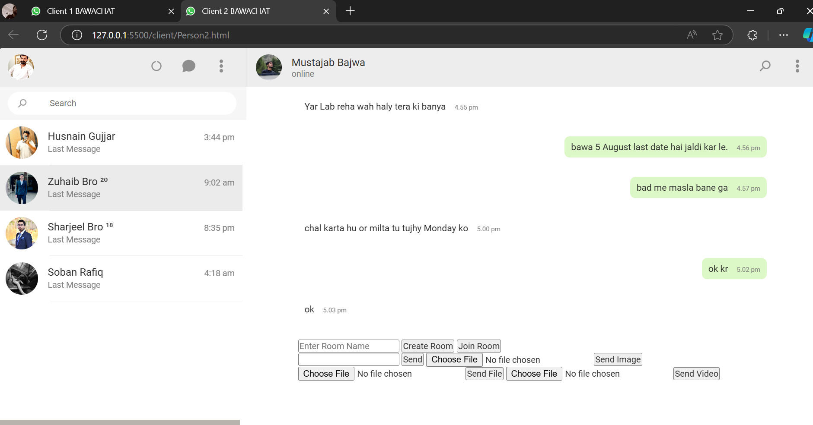

Here's a sample **README** for the "Bawa" chat application:

---

# Bawa Chat Application

Bawa is a WhatsApp clone that allows users to communicate through messaging, sharing files, and images within the same group. It is designed to demonstrate core chat functionalities like sending text messages, sharing images, and files across multiple clients connected to the same group or chat room.

## Features

- **Group Messaging**: Users can join the same group chat and exchange messages in real-time.
- **File Sharing**: Send and receive various file types, including documents, PDFs, and more.
- **Image Sharing**: Seamlessly share images between clients in a group chat.
- **Client Interface**: Includes two clients (Client 1 and Client 2) that simulate user interactions within the chat environment.
- **Real-time Communication**: Messages and media are delivered instantly within the group.

## How to Run the Application

### Prerequisites

- Make sure you have the following installed:
  - [Node.js](https://nodejs.org/)
  - [Socket.io](https://socket.io/)
  - Any necessary libraries for file/image handling.

### Steps

1. **Clone the Repository**  
   ```bash
   git clone <repository-url>
   cd bawa-chat-application
   ```

2. **Install Dependencies**  
   Install the required packages using npm:  
   ```bash
   npm install
   ```

3. **Run the Server**  
   Start the server to handle multiple clients:  
   ```bash
   node server.js
   ```

4. **Client 1 and Client 2**  
   You can simulate two different clients by opening two separate browser windows or tabs. Both clients can join the same group and start messaging, sending files, and sharing images.

## Screenshots

### Client 1 Interface
- A screenshot showing the chat interface of Client 1 with messages, file sharing, and image options.


### Client 2 Interface
- A screenshot showing the chat interface of Client 2 with similar functionalities, interacting with Client 1.

## Technologies Used

- **Node.js**: Server-side logic for real-time communication.
- **Socket.io**: Manages the WebSocket connection between clients and the server.
- **HTML/CSS/JavaScript**: Frontend for rendering the chat interface and interactions.

## Future Enhancements

- Implementing **Voice/Video Calling**.
- Adding **End-to-End Encryption** for messages.
- Improving the **UI/UX** for a more polished look.

## License

This project is open-source and available for use and modification under the MIT License.

